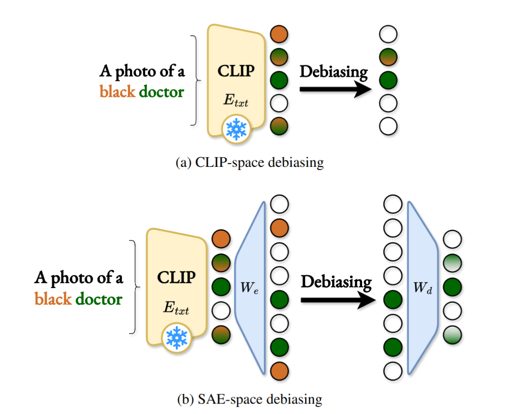

<div align="center">

<a href="https://www.python.org"></a>
<a href="https://pytorch.org/get-started/locally/"></a>
<a href="https://cvpr.thecvf.com/Conferences/2026"></a>

<h1>SEM: Sparse Embedding Modulation for Post-Hoc Debiasing of Vision-Language Models</h1>

**Official PyTorch Implementation**

[Quentin Guimard](https://mardgui.github.io/)<sup>1,\*</sup> · [Federico Bartsch](https://www.linkedin.com/in/federico-bartsch/)<sup>1,\*</sup> · [Simone Caldarella](https://simonecaldarella.github.io/)<sup>1</sup> · [Rahaf Aljundi](https://www.linkedin.com/in/rahaf-aljundi/)<sup>2</sup> · [Elisa Ricci](https://eliricci.eu/)<sup>1,3</sup> · [Massimiliano Mancini](https://mancinimassimiliano.github.io/)<sup>1</sup>

<sup>1</sup>University of Trento &nbsp;|&nbsp; <sup>2</sup>Toyota Motor Europe &nbsp;|&nbsp; <sup>3</sup>Fondazione Bruno Kessler
<br>
_<sup>*</sup>Equal contribution_

<br>

<a href="https://sparse-embedding-modulation.github.io"></a>
<a href="https://arxiv.org/abs/2603.19028"></a>
<a href="https://github.com/mardgui/SEM/blob/main/LICENSE"></a>

<br>



</div>

______________________________________________________________________

## Table of Contents

- [Abstract](#abstract)
- [Software Requirements](#-software-requirements)
- [Dataset Preparation](#-dataset-preparation)
- [Usage & Reproduction](#-usage--reproduction)
  - [1. Training-Based Methods & Weights](#1-training-based-methods--weights)
  - [2. Pre-computation](#2-pre-computation)
  - [3. Evaluation](#3-evaluation)
- [Analysis & Visualization](#-analysis--visualization)
- [Citation](#citation)

______________________________________________________________________

## Abstract

Models that bridge vision and language, such as CLIP, are key components of multimodal AI. Yet, their large-scale, uncurated training data introduces severe **social and spurious biases**. Existing post-hoc debiasing methods often operate directly in the dense CLIP embedding space, where bias and task-relevant information are highly _entangled_—making it difficult to remove bias without degrading semantic fidelity.

In this work, we propose **Sparse Embedding Modulation (SEM)** — a post-hoc, zero-shot debiasing framework that operates in a Sparse Autoencoder (SAE) latent space. By decomposing CLIP text embeddings into _disentangled_ features, SEM can pinpoint and modulate bias-relevant neurons while safely preserving query-relevant ones.

This approach enables more precise, non-linear interventions. Across four benchmark datasets and two CLIP backbones, SEM achieves **substantial fairness gains** in retrieval and zero-shot classification, demonstrating that sparse latent representations provide a highly effective foundation for debiasing vision-language models.

______________________________________________________________________

## 🛠️ Software Requirements

This codebase is written in **Python**. We recommend using [`uv`](https://github.com/astral-sh/uv) for fast and reliable dependency management.

**1. Create and activate a virtual environment:**

```bash
uv venv
source .venv/bin/activate
```

**2. Install PyTorch:**
*(Note: Adjust the [index URL](https://pytorch.org/get-started/locally/) based on your specific CUDA version requirements.)*

```bash
uv pip install torch torchvision
```

**3. Install the remaining dependencies:**

```bash
uv pip install -r requirements.txt
```

______________________________________________________________________

## 📂 Dataset Preparation

Please download the following datasets and organize them into the `./data/` directory.

| Dataset | Reference | Link | Note |
| :--- | :--- | :--- | :--- |
| **FairFace** | Karkkainen et al., WACV 2021 | [GitHub repository](https://github.com/joojs/fairface) | Mandatory for evaluation (padding = 0.25) |
| **UTKFace** | Zhang et al., CVPR 2017 | [Kaggle dataset](https://www.kaggle.com/datasets/jangedoo/utkface-new) | Mandatory for evaluation (aligned & cropped faces) |
| **CelebA** | Liu et al., ICCV 2015 | [Dataset website](https://mmlab.ie.cuhk.edu.hk/projects/CelebA.html) | Mandatory for evaluation (aligned & cropped faces) |
| **Waterbirds** | Sagawa et al., ICLR 2020 | [GitHub repository](https://github.com/kohpangwei/group_DRO) | Mandatory for evaluation (official tarball) |
| **FACET** | Gustafson et al., ICCV 2023 | [Dataset website](https://ai.meta.com/datasets/facet/) | ZSDebias training only |
| **COCO** | Lin et al., ECCV 2014 | [Dataset website](https://cocodataset.org/#download) | ZSDebias training only (2017 train set) |
| **ImageNet-100** | Tian et al., ECCV 2020 | [GitHub repository](https://github.com/danielchyeh/ImageNet-100-Pytorch) | ZSDebias training only (original imagenet100.txt) |

**Expected Directory Structure:**

```text
./
├── ...
├── data/
│   ├── CelebA/
│   │   ├── Anno/
│   │   ├── Eval/
│   │   ├── Img/
│   │   │   └── img_align_celeba/
│   │   └── ...
│   ├── COCO/
│   │   ├── train2017/
│   │   ├── instances_train2017.json
│   │   └── ...
│   ├── FACET/
│   │   ├── images/
│   │   ├── annotations.csv
│   │   └── ...
│   ├── FairFace/
│   │   ├── train/
│   │   ├── val/
│   │   ├── fairface_label_train.csv
│   │   ├── fairface_label_val.csv
│   │   └── ...
│   ├── ImageNet-100/
│   │   ├── train/
│   │   ├── imagenet100.txt
│   │   └── ...
│   ├── LFW/
│   │   ├── images/
│   │   └── ...
│   ├── UTKFace/
│   │   ├── images/
│   │   └── ...
│   └── Waterbirds/
│       ├── waterbirds_complete95_forest2water2/
│       └── ...
└── ...
```

Alternatively, you can use the precomputed CLIP embeddings for each dataset (4 backbones: ViT-B/16, ViT-L/14@336px, RN50, RN101) available in the [GitHub releases](https://github.com/mardgui/SEM/releases/tag/v1.0).

______________________________________________________________________

## 🚀 Usage & Reproduction

### 1\. Training-Based Methods & Weights

#### **SEM (Ours)**

We rely on a general-purpose Matryoshka Sparse Autoencoder (MSAE) (Zaigrajew et al., ICML 2025).

  * **Pre-trained weights:** one model for each tested CLIP backbone (4 files). You can download and extract them directly from the GitHub releases:
    ```bash
    wget https://github.com/mardgui/SEM/releases/download/v1.0/sae_weights.zip
    unzip sae_weights.zip -d ./debiasing_methods/sae_weights/
    ```
  * **Training the model:** please refer to [the original MSAE repository](https://github.com/WolodjaZ/MSAE) if you wish to train a new SAE model.

#### **PRISM (Baseline)**

PRISM requires building a small text dataset and training a linear layer for every backbone/target/bias combination (324 configurations x 3 seeds = 972 models total).

  * **Pre-trained weights:** one model for each configuration (972 files). You can download and extract them directly from the GitHub releases:
    ```bash
    wget https://github.com/mardgui/SEM/releases/download/v1.0/prism_weights.zip
    unzip prism_weights.zip -d ./debiasing_methods/prism_weights/
    ```
  * **Reproduction:** we provide the training script and a shell script to generate all necessary models:
    ```bash
    # Train all 972 configuration models
    bash ./train_all_prism.sh
    ```
    *(Individual training script location: `./debiasing_methods/prism_training.py`)*

#### **ZSDebias (Baseline)**

ZSDebias requires building a bias-specific vision dataset and bias text corpus for each type of bias. For demographic bias on faces, a combination of FACET, LFW, and UTKFace is used for training. For background bias on animals, a combination of ImageNet-100 and MS-COCO (animal subset) is used for training. The bias text corpus is based on combinations of pre-defined text prompts. VAE-based "adaptors" are trained for each bias type / backbone (8 configurations x 3 seeds = 24 models total).

  * **Pre-trained weights:** one model for each configuration (24 files). You can download and extract them directly from the GitHub releases:
    ```bash
    wget https://github.com/mardgui/SEM/releases/download/v1.0/zsdebias_weights.zip
    unzip zsdebias_weights.zip -d ./debiasing_methods/zsdebias_weights/
    ```
  * **Reproduction:** we provide the training script and a shell script to generate all necessary models:
    ```bash
    # Make sure all CLIP embeddings are pre-computed (see precompute_all_clip_embeddings.sh)
    # Train all 24 configuration models
    bash ./train_zsdebias.sh
    ```
    *(Individual training script location: `./debiasing_methods/zsdebias_training.py`)*

### 2\. Pre-computation

Before running the evaluation, pre-compute the CLIP embeddings for the datasets and generate the k-fold cross-validation indices.

```bash
# Compute embeddings for all datasets/backbones
bash ./precompute_all_clip_embeddings.sh

# Generate k-fold indices for all evaluation datasets
bash ./generate_all_splits.sh
```
*(Individual scripts locations: `./precompute_embeddings.py` and `./generate_splits.py`)*

Alternatively, to save on computation time, you can use the precomputed CLIP embeddings available in the [GitHub releases](https://github.com/mardgui/SEM/releases/tag/v1.0). We also provide the k-fold indices that were used in the paper for all evaluation datasets to ensure reproducibility.

### 3\. Evaluation

To run the complete evaluation pipeline (Retrieval and Zero-Shot Classification) using the configurations described in the paper (all datasets / all backbones / all baselines):

```bash
# Run full evaluation suite
bash ./run_eval.sh

# Process the JSON eval outputs
python process_json_outputs.py

# Reproduce the tables from the paper
python reproduce_table_2.py
python reproduce_table_3.py
python reproduce_table_9.py
python reproduce_table_13.py
python reproduce_table_14.py
python reproduce_table_15.py
```
*Individual script location: `./main_eval.py`. Specific configurations for different datasets and methods can be found in the `./config/` directory.*

To save on computation time and ensure reproducibility, we also include in `./main_eval_output` the precomputed JSON outputs for the whole `run_eval.sh` script.

______________________________________________________________________

## 📊 Analysis & Visualization

We provide the exact code used to generate the analytical figures in the paper.

### Disentanglement Study (Section 3.1)

This study quantifies the entanglement of bias and content in SAE latent space versus CLIP embedding space.

**Location:** `./disentanglement_study/`

**Steps to reproduce:**

1.  Move into the directory:
    ```bash
    cd disentanglement_study
    ```
2.  Precompute the probing datasets:
    ```bash
    bash ./precompute_all.sh
    ```
    *(Individual script location: `./disentanglement_study/precompute_dataset.py`)*
3.  Run the probing experiments (Linear Probe training):
    ```bash
    bash ./run_all_disentanglement_exps.sh
    ```
    *(Individual script location: `./disentanglement_study/disentanglement_experiment.py`)*
4.  Generate the plot (Figure 2 in main paper):
    ```bash
    python ./generate_disentanglement_plot.py
    ```
    *Output: `./disentanglement_study/disentanglement_score_plot.pdf`*

### Qualitative PCA Study (Section 4.2)

This study visualizes the geometric structure of gendered profession embeddings before and after debiasing.

**Location:** `./qualitative_study/`

**Steps to reproduce:**

1.  Move into the directory:
    ```bash
    cd qualitative_study
    ```
2.  Run the PCA analysis and plotting script:
    ```bash
    python ./pca.py
    ```
    *Output: `./qualitative_study/pca_profession_gender.pdf`*

______________________________________________________________________

## Citation

If you find this work useful, please consider citing:

```bibtex
@inproceedings{guimardbartsch2026sem,
  title={{SEM: Sparse Embedding Modulation for Post-Hoc Debiasing of Vision-Language Models}},
  author={Guimard, Quentin and Bartsch, Federico and Caldarella, Simone and Aljundi, Rahaf and Ricci, Elisa and Mancini, Massimiliano},
  booktitle={Findings of the IEEE/CVF Conference on Computer Vision and Pattern Recognition (CVPR)},
  year={2026}
}
```
